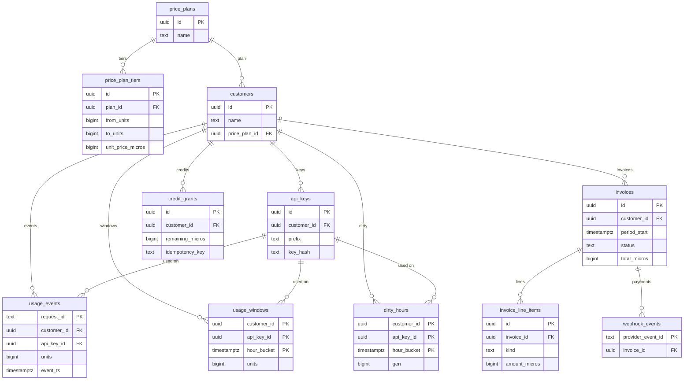

# Design

This is a metered billing core. Customers call an API, we count units, and once a month we issue an invoice.

The brief is about 5,000 customers, 200 events/sec (2,000 at peak). Invoices have to be correct. I did not add a message queue or extra services. One Postgres, two processes, and a small UI is enough at that size if writes stay simple. If traffic later outgrows this, the change path is written below — we would not throw away the billing schema.

## How it is put together

Go + Postgres + a React UI. One repo. After clone, follow **[README.md](README.md)** (`docker compose up --build`, then seed). The notes below are the design, not the runbook.

The company uses Django. I used Go because I am faster with concurrent ingest and tests that hit a real database. Postgres is the part the brief actually needs. The UI is React + TypeScript, like theirs.

Two processes share the same database. They do not call each other:

- **api** — HTTP for customers (`/v1`), ops (`/ops`), and the payments webhook
- **worker** — rebuilds dirty hours, then issues last month’s invoices

`cmd/seed` loads fake product traffic so the UI has something to show.

Ingest is **synchronous**. HTTP 200 means the event is in Postgres. A queue in front would only delay the uniqueness check (`request_id` still has to land in the database). At 200/sec a batched insert is enough. Queues become the next step if the API starts waiting on disk, not a day-one requirement.

Shared rules live in `internal/domain`: plan id, page sizes, env names, error strings, and the store interfaces. HTTP auth that repeats across routes is middleware (`requireCustomer` on `/v1`, `requireOps` on `/ops`). Health and the webhook stay outside that, because they authenticate differently.

## Pipeline

```
POST /v1/events     →  usage_events + mark dirty_hours
worker (often)      →  SUM events for that hour → upsert usage_windows
worker (month)      →  SUM windows for last month → invoice + lines + credits
webhook             →  invoice status = paid
```

The hour comes from `event_ts` (when the product call happened), not from when we received the HTTP batch. Late events still land in the right hour.

The worker does **not** do `window.units += event`. It recomputes the hour from events, then upserts the window. If the job runs twice, the number is the same. Adding would double-bill on retry.

`dirty_hours.gen` goes up on every new event for that hour. The worker deletes the dirty row only if `gen` still matches. A late event during the job bumps `gen`, the delete misses, and the hour stays dirty for the next run.

The invoice job **waits** if any hour in that period is still dirty. That way we do not issue a $0 July because the worker had not caught up yet.

Pricing uses the **month total**, not each hour. Current plan: first 10k units free, next 90k at $0.001, the rest at $0.0005. Line items are one row per tier that has quantity, then credit lines if any.

## Database

Yes, a diagram belongs here. Reviewers can see the FKs without opening SQL. Mermaid stays in this file, so it does not rot as a screenshot.



`price_plans` is the catalog. `customers.price_plan_id` points at it. Tiers are not a string on the customer; they live in `price_plan_tiers`.

Windows are `customer × hour × api_key`, not only `customer × hour`. Billing still sums the month for the customer. `GET /v1/usage?api_key=` can filter without a second table. That is more rows (~7M/month at brief size, not 3.5M). That is cheap. A later customer-hour rollup is optional if the chart gets slow.

Events are append-only. Windows are rebuilt from events. An issued invoice is a snapshot. Paid invoices do not change.

Events and windows also store `customer_id` even though it can be derived from the key. That is on purpose: RLS and the hour job can filter without a join. The two FKs do not force them to match; the app always writes both from the authenticated key.

`audit_entries` is insert-only (trigger blocks UPDATE/DELETE). `entity_id` is not a foreign key. `job_locks` is in the schema and unused. The hour job uses `FOR UPDATE SKIP LOCKED`. The month job uses `UNIQUE (customer_id, period_start)`: if two workers issue July for the same customer, one insert wins.

### Money

Tiers are $0.001 and $0.0005. Cents cannot store that. Amounts are integer **microdollars**: $1 = 1,000,000. $0.001 per unit is 1000. Totals are `qty * unit` in integer math. The UI divides by 1e6 to show dollars.

### Indexes we actually use

- events `(customer_id, api_key_id, event_ts)` — recompute one hour
- windows `(customer_id, hour_bucket)` — monthly sum and the usage chart
- windows `(customer_id, api_key_id, hour_bucket)` — usage filtered by key
- invoices `(customer_id, issued_at desc)` — list
- `UNIQUE (customer_id, period_start)` — one invoice per month
- `api_keys.key_hash` unique — lookup on every ingest
- `credit_grants.idempotency_key` unique

At ~10x load I would partition events and windows by month. After that, the path is a queue and then moving raw events off this database — see **If traffic grows**.

## Idempotency

Do not SELECT then INSERT. Two requests can both see “missing”. The unique constraint is the lock. “Already there” is success.

| Path | Lock | Replay |
| --- | --- | --- |
| Ingest | `request_id` PK | `ON CONFLICT DO NOTHING`, response counts inserted vs duplicates |
| Hour job | recompute + upsert | same totals |
| Invoice job | `UNIQUE (customer_id, period_start)` | second run is a no-op |
| Webhook | `provider_event_id` PK | only the first insert may set paid |
| Ops credit | `Idempotency-Key` unique | same key returns the same grant |
| Override | `FOR UPDATE` on the invoice | paid invoices are rejected |

Customer id on an event comes from the authenticated key, not from the body. A stolen `request_id` from another tenant cannot write into their ledger.

## Late events

**Door A (coded).** The month is not issued yet. We store the event, mark the hour dirty, rebuild the window. The invoice will include it.

**Door B (not coded).** The invoice is already issued. We still store the event and refresh the window (the meter should be true). We do **not** rewrite the invoice the customer already saw. Extra units would be a later adjustment or an ops credit. The brief did not ask for a full reconciliation system.

## Auth and tenants

- Customer routes take a Bearer API key. Middleware hashes it (SHA-256 + `KEY_PEPPER`) and loads the key row. Plaintext is printed once by seed and never stored.
- Ops routes take a shared `OPS_TOKEN`. That is a gap: it is not per-user SSO.
- The webhook checks `X-Webhook-Signature` (HMAC of the raw body). Bad sig is 401.
- `/v1` never trusts `customer_id` in the URL or body. The id is `SET LOCAL` in the same transaction. RLS on tenant tables: you only see your rows unless ops. Guessing another customer’s invoice id is **404**, not 403.
- CORS is an allowlist. A browser from a random origin gets 403. curl with no Origin still works.

## API and UI

Customer: `POST /v1/events`, `GET /v1/usage`, `GET /v1/invoices`, `GET /v1/invoices/{id}`.

Usage is cursor pagination `(hour, api_key_id)` because that series can be large. Invoices use offset; a customer has a few dozen a year.

Ops: list/detail customers, credits, get invoice, override a line, payments webhook.

Credits and overrides in the UI need a confirm modal and a reason. Credit sends `Idempotency-Key`. Buttons disable while the request is in flight.

## Tests that cover the pipeline

Against a real Postgres:

- same `request_id` does not double, including two concurrent inserts
- HTTP ingest replay returns inserted then duplicates
- dirty hour is marked on ingest, job `SUM`s the hour, a second job is a no-op, a new event recomputes (not `+=`)
- invoice is **not** issued while dirty hours remain; after drain, totals match the tiers
- issuing the same month twice still leaves one invoice
- credit with the same idempotency key once; override rejected when paid; webhook replay does not pay twice
- another customer’s invoice is 404

Not covered yet: `gen` bump while the hour job is running, credits on the **next** invoice end-to-end, two hour workers racing, Door B.

## Scale at the brief’s numbers

500 million events/month is ~19/sec average, 200 sustained, 2,000 peak. Windows ~7 million rows/month. Invoices 5,000 rows/month.

What would break first is **events on the same disk as invoices**, not the invoice table. If the hour job lags, `/v1/usage` looks low until catch-up; invoices wait, so they stay correct but late. More workers already work because of `SKIP LOCKED`.

Invoice count, credits, and audit stay small. They will not be the first bottleneck.

## Simple is not the same as finished

In my experience there is no “simple design” that never has to grow or get harder. The first mistake I have seen, year after year, is thinking a small setup will fully solve the problem and that we can worry about scale later.

You have to be ready from day one if traffic jumps or the problem gets messier. That is why this design follows the **open/closed** idea: the billing rules stay closed (events, dirty hours, windows, invoices, unique keys), and ingest stays **open** to a new implementation if this one breaks under load. We would not rewrite how money is counted. We would change how events arrive — queue, then events off this database — as in the path below.

## If traffic grows

This layout is meant to fail in a known order. We do not need a new billing model when QPS goes up. Windows, invoices, credits, and the unique keys stay. Only how events arrive would change.

**1. Today (brief size).** HTTP → Postgres in the same request. Worker rebuilds dirty hours from `usage_events`.

**2. First pain (~10x, about 2,000/sec sustained).** WAL and autovacuum on `usage_events` slow down invoices and backups. **Change:** partition `usage_events` and `usage_windows` by month. Same tables, same API. Add hour workers if `dirty_hours` ages past a few minutes.

**3. Next: the API is waiting on inserts.** Put a **queue** in front of a small writer pool that still writes to Postgres. Redis, SQS, or a table used as a queue is enough. Kafka is for later, when you need many consumers and long retention — it is a bigger operational jump than we need at the first bottleneck. Uniqueness does not move: the writer still does `ON CONFLICT DO NOTHING` on `request_id`. HTTP can return 202 once the message is queued; the customer-visible 200 “it is billed” stays when the row exists.

**4. Much later (~50–100x).** Raw events leave the billing database (object store or a dedicated event store). The worker reads from there and only writes **windows + invoices + credits** to this Postgres. Billing tables and the invoice job do not change.

What we are already ready for: `SKIP LOCKED` on dirty hours, idempotent ingest and invoices, invoice job that waits until hours are clean. What we would add only when metrics say so: partitions, then a queue, then moving events off the primary.

## What I did not build

- Door B adjustments after an invoice is issued
- Real ops users / RBAC (today: one token)
- Prepaid / kill-switch (this product is postpaid monthly)
- Key rotation UI
- Using `job_locks`
- A queue in front of ingest (see the path above)
- Moving events off Postgres (only when numbers say so)

If this shipped next: Door B as a next-period line, ops login, partition `usage_events` by month.

## Debugging a wrong invoice

Ops: open the invoice, read line items, `SUM(usage_windows)` for that customer and period, compare to the tier math. If the window is wrong, `SUM(usage_events)` for those hours. If events look right and windows do not, mark the hours dirty and recompute. If the invoice already issued disagrees with windows, do not UPDATE it; credit or adjust next period, and read audit for an override.
